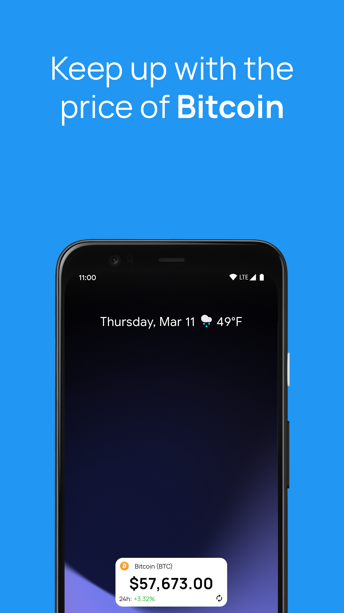
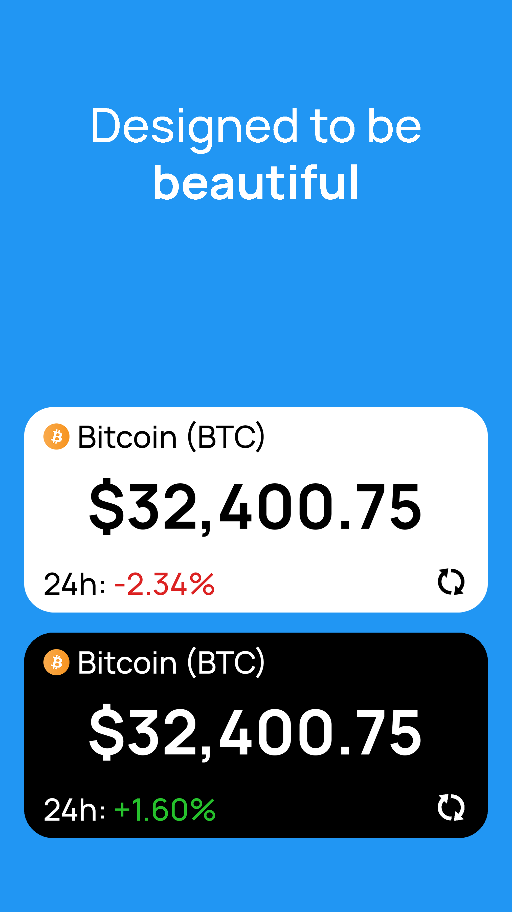

# Simple Bitcoin Widget

A simple Bitcoin price widget for your home screen 📈

This Android application allows you to place a sleek and minimal Bitcoin price widget on your home screen! Simple Bitcoin Widget sources price information from the CoinGecko API.
The widget conforms to your current system device theme - light and dark mode!

New features will be added as I work on them! Thank you for the support!

## Screenshots

  
  
  

## Built With
* [OkHttp](https://square.github.io/okhttp/) - HTTP client
* [Gson](https://github.com/google/gson) - Gson is a Java library that can be used to convert Java Objects into their JSON representation
* [Material Icons](https://material.io/resources/icons/) - Material IO Icons
* [Manrope Font](https://manropefont.com/) - Manrope Font used for text

## License
This project is licensed under the GNU General Public License v3.0 - see the [LICENSE](LICENSE) file for details

## Developer
Julian Coronado
