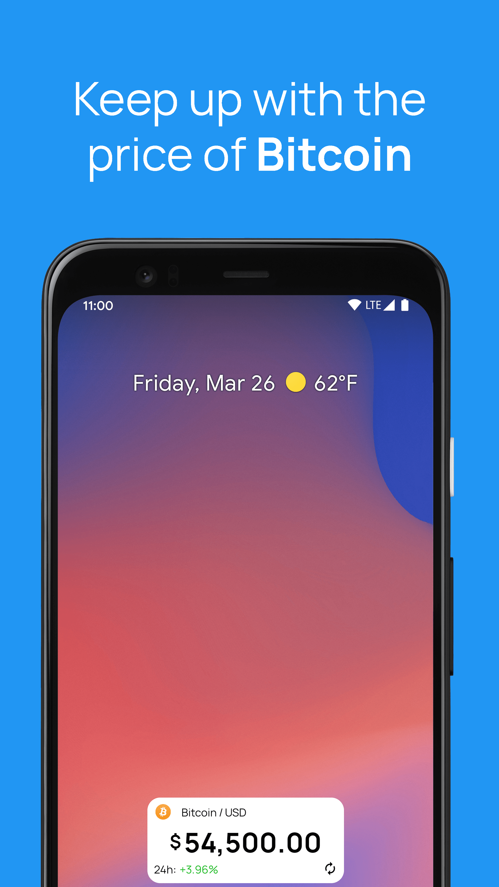
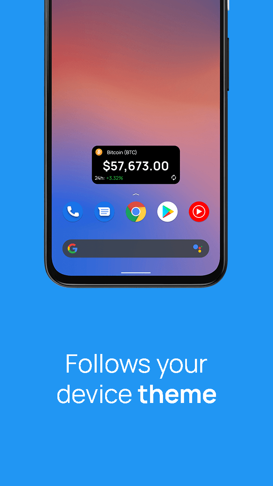
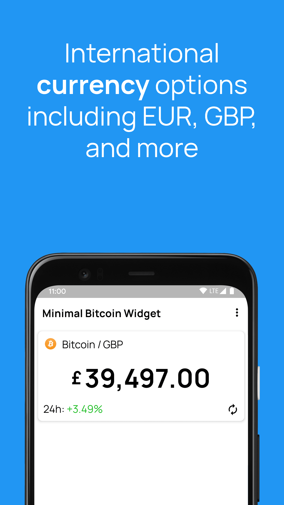
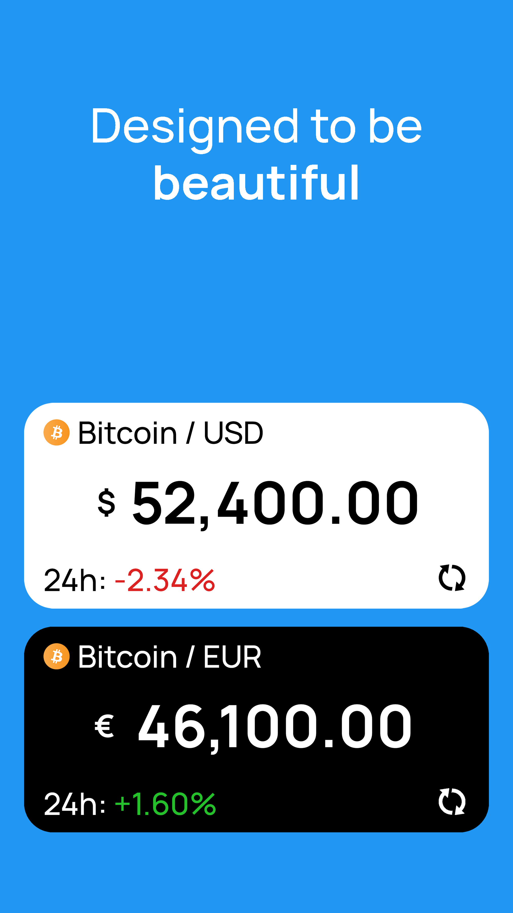

# Minimal Bitcoin Widget

Built with Flutter 3.16.9

A minimal Bitcoin price widget for your home screen!

The widget conforms to your current system device theme and you can select which currency to view the price in (USD, GBP, EUR, MXN, and AUD).

Price information provided by CoinGecko.

New features will be added as I work on them! Thank you for the support!

Google Play and the Google Play logo are trademarks of Google LLC.

## Screenshots

  
  
  
  

## Built With

- [Flutter](https://flutter.dev/) - Flutter Framework
- [Material Icons](https://material.io/resources/icons/) - Material IO Icons
- [Manrope Font](https://manropefont.com/) - Manrope Font used for text
- [Android Studio](https://developer.android.com/studio) - Official IDE for Android app development

## Known Issues

## License

This project is licensed under the GNU General Public License v3.0 - see the [LICENSE](LICENSE) file for details

## Developer

Julian Coronado - [jcoronado.dev](https://jcoronado.dev)
