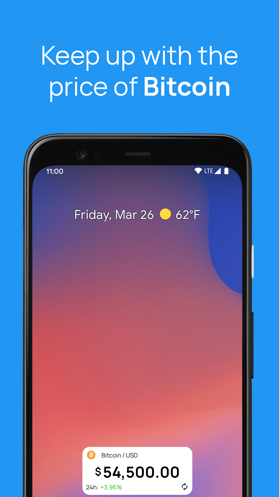
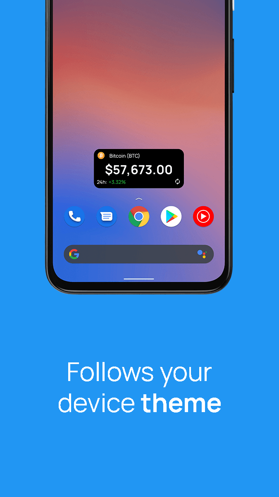
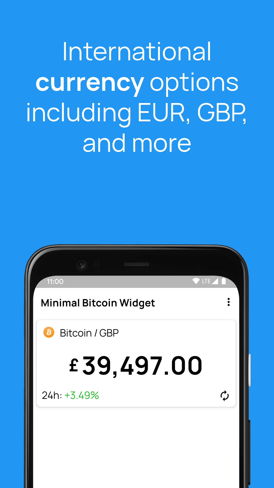
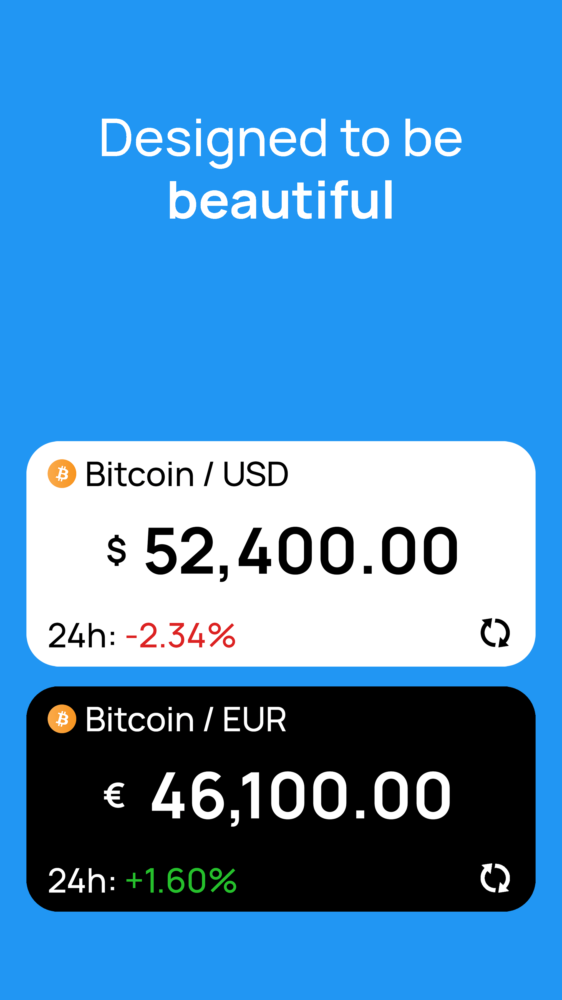

# Minimal Bitcoin Widget

A minimal, open-source Bitcoin price widget for your Android home screen. Track the price of Bitcoin in your preferred currency with a clean, modern widget that respects your device's system theme.

*Google Play and the Google Play logo are trademarks of Google LLC.*

## Features

- **Real-time Price Tracking**: Get the latest Bitcoin price.
- **Multiple Currencies**: Supports USD, GBP, EUR, CAD, MXN, BRL, and AUD.
- **Dynamic Theming**: Adapts to your device's light or dark theme.
- **Homescreen Widget**: Keep an eye on the price directly from your home screen.
- **Clean & Minimal**: A simple, focused user interface.

## Screenshots

  
  
  
  

## Getting Started

To build and run the project locally, you can clone the repository and open it in Android Studio.

1.  **Clone the repository.**
2.  **Open the project in Android Studio.**
3.  **Build & Run:** Let Gradle sync, then build and run the app on an emulator or a physical device.

## Built With

- [OkHttp](https://square.github.io/okhttp/): For making HTTP requests to the CoinGecko API.
- [Gson](https://github.com/google/gson): For parsing JSON data.
- [Material Icons](https://material.io/resources/icons/): For icons used in the app.
- [Manrope Font](https://manropefont.com/): Custom font used throughout the app.

## Known Issues

- The home screen widget may not refresh when Low Power Mode is enabled.
- The widget can occasionally get stuck on the loading state. A manual refresh usually resolves this.
- On shorter displays, the widget layout is not displayed properly.

## Contributing

Contributions are what make the open-source community such an amazing place to learn, inspire, and create. Any contributions you make are **greatly appreciated**.

If you have a suggestion that would make this better, please fork the repo and create a pull request. You can also simply open an issue with the tag "enhancement".

1.  Fork the Project
2.  Create your Feature Branch (`git checkout -b feature/AmazingFeature`)
3.  Commit your Changes (`git commit -m '''Add some AmazingFeature'''`)
4.  Push to the Branch (`git push origin feature/AmazingFeature`)
5.  Open a Pull Request

## License

Distributed under the GNU General Public License v3.0. See the `LICENSE` file for more information.

## Acknowledgments

- Price data provided by the [CoinGecko API](https://www.coingecko.com/api).

## Contact & Support

Julian Coronado - [jcoronado.dev](https://jcoronado.dev)

If you'd like to support the development of this project, feel free to donate!

**Donate via Strike (Bitcoin & Lightning):** [strike.me/jcoronado](https://strike.me/jcoronado)
