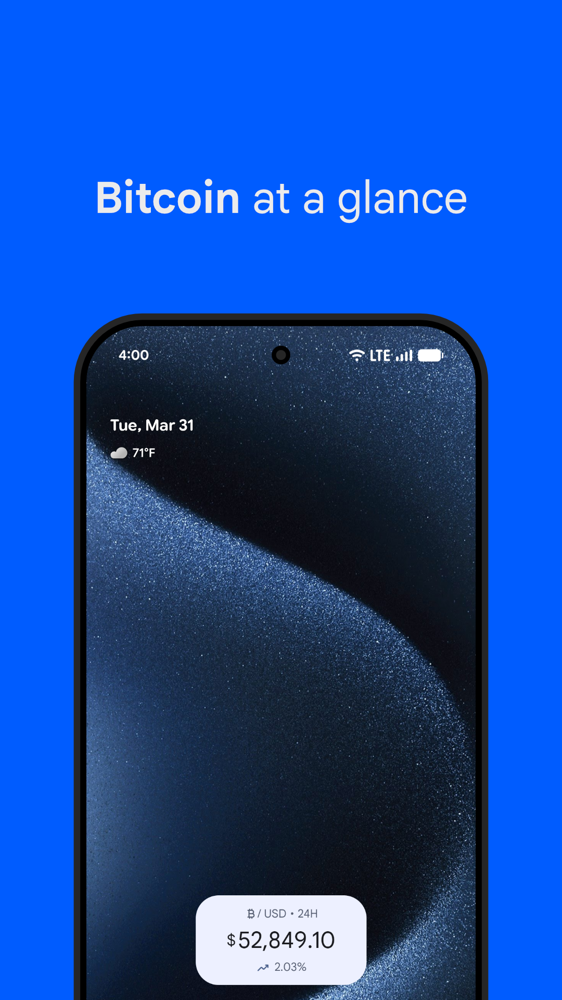
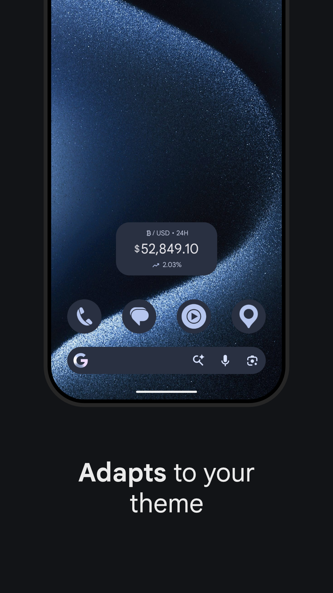
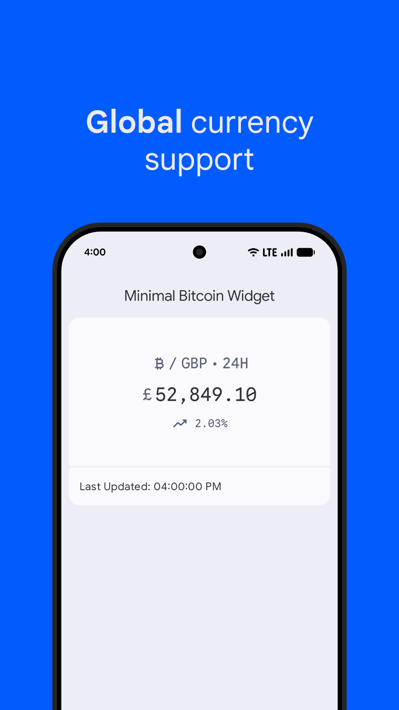
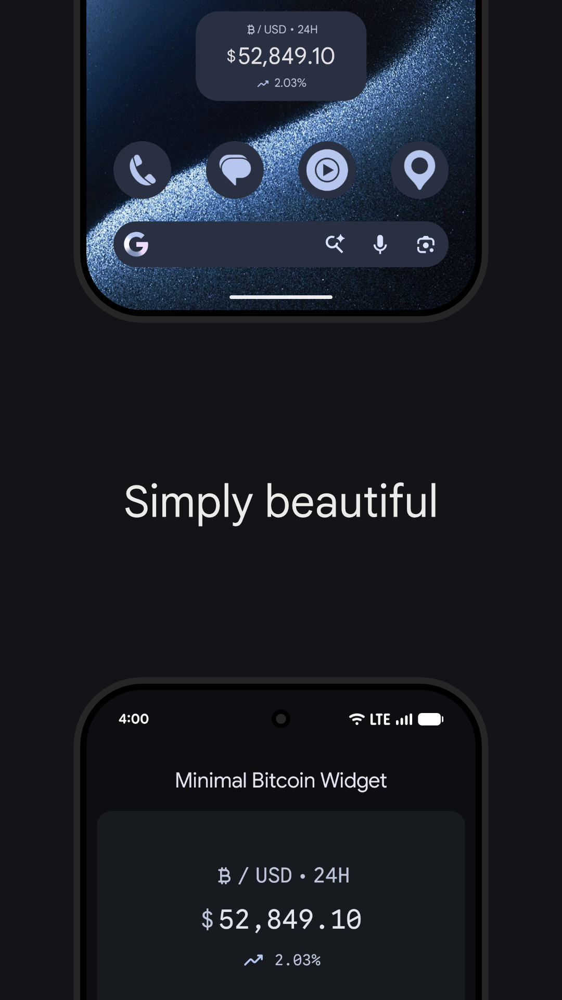

# Minimal Bitcoin Widget

A minimal, open-source Bitcoin price widget for your Android home screen. Track the price of Bitcoin in your preferred currency with a clean and modern widget .

*Google Play and the Google Play logo are trademarks of Google LLC.*

## Features

- **Real-time Price Tracking**: Stay updated with the latest Bitcoin price data provided by the CoinGecko API.
- **Multiple Currencies**: Support for a wide range of currencies including USD, GBP, JPY, EUR, CAD, MXN, AUD, and BRL.
- **Customizable Timeframes**: Choose to display price change percentages for 24 hours, 7 days, or 30 days.
- **Homescreen Widgets**: Beautiful, modern widgets built with Jetpack Compose Glance, plus a legacy widget option for broader compatibility.
- **Configurable Refresh Rates**: Tailor the background update frequency to your needs with 1, 4, or 8-hour refresh intervals.
- **Material Design 3**: A clean and modern user interface using the latest Material 3 Expressive components.
- **Dynamic Theming**: Support for Material You dynamic colors on Android 12+ and seamless Light/Dark/System theme switching.
- **Privacy-Focused**: Open-source, no ads, no tracking.

## Screenshots

  
  
  
  

## Getting Started

To build and run the project locally, you can clone the repository and open it in Android Studio.

1.  **Clone the repository.**
2.  **Open the project in Android Studio.**
3.  **Build & Run:** Let Gradle sync, then build and run the app on an emulator or a physical device.

## Built With

- [Kotlin](https://kotlinlang.org/): Primary programming language.
- [Jetpack Compose](https://developer.android.com/compose): Modern toolkit for building native UI.
- [Material 3 Expressive](https://developer.android.com/jetpack/compose/designsystems/material3): Latest Material Design features and components.
- [Glance](https://developer.android.com/jetpack/compose/glance): Build app widgets with a Jetpack Compose-style API.
- [WorkManager](https://developer.android.com/topic/libraries/architecture/workmanager): For reliable, periodic background price updates.
- [Navigation 3](https://developer.android.com/jetpack/compose/navigation): Modern, type-safe navigation for Compose.
- [Room](https://developer.android.com/training/data-storage/room): For local database persistence and caching.
- [OkHttp](https://square.github.io/okhttp/): For making efficient HTTP requests to the CoinGecko API.
- [Gson](https://github.com/google/gson): For robust JSON serialization and parsing.

## Contributing

Contributions are what make the open-source community such an amazing place to learn, inspire, and create. Any contributions made are **greatly appreciated**.

If you have a suggestion that would make this better, please fork the repo and create a pull request. You can also simply open an issue with the tag "enhancement".

1.  Fork the Project
2.  Create your Feature Branch (`git checkout -b feature/AmazingFeature`)
3.  Commit your Changes (`git commit -m '''Add some AmazingFeature'''`)
4.  Push to the Branch (`git push origin feature/AmazingFeature`)
5.  Open a Pull Request

## License

Distributed under the GNU General Public License v3.0. See the `LICENSE` file for more information.

## Acknowledgments

- Price data provided by the [CoinGecko API](https://www.coingecko.com/api).

## Contact & Support

Julian Coronado - [jcoronado.dev](https://jcoronado.dev)

If you'd like to support the development of this project, feel free to donate!

**Donate via Strike (Bitcoin & Lightning):** [strike.me/jcoronado](https://strike.me/jcoronado)
